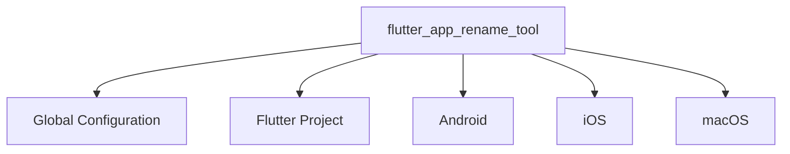

# Flutter App Rename Tool

## Configuration File Structure (YAML Format)



### Configuration Example
```yaml
# ===== Basic Identifiers =====
flutter_app_rename_tool:
  app_name: far_altman  # Tool instance ID (used for log identification)

  # ===== Flutter Configuration =====
  flutter:
    enable: false # Optional, default is true
    app_name: far_altman_flutter   # Optional, ⚠️ Modify the 'name' field in pubspec.yaml

  # ===== Platform-Specific Configuration =====
  android:
    enable: false
    app_name: Far Altman # Optional, desktop icon name
    package: com.example.app.android

  ios:
    app_name: Far Altman
    bundle_name: FARIOS
    bundle_ids:
      debug: com.example.app.debug.ios
      profile: com.example.app.profile.ios
      release: com.example.app.release.ios

  macos:
    app_name: Far Altman
    bundle_name: FARMac
    copyright: Copyright © 2025 FAR Inc.
    bundle_id: com.example.app.macos
```

### 📌 iOS/macOS Multi-Target Configuration
```yaml
flutter_app_rename_tool:
  app_name: far_altman

  flutter:
    enable: false # Optional, default is true
    app_name: far_altman_flutter

  android:
    app_name: Far Altman
    package: com.example.app.android

  ios:
    - app_name: Far Altman
      bundle_name: FARIOS
      target_name: Runner
      bundle_ids:
        debug: com.example.app.debug.ios
        profile: com.example.app.profile.ios
        release: com.example.app.release.ios

    - enable: false
      app_name: Far Altman Tests
      bundle_name: FARIOSTests
      target_name: RunnerTests
      bundle_ids:
        debug: com.example.RunnerTests.debug.ios
        profile: com.example.RunnerTests.profile.ios
        release: com.example.RunnerTests.release.ios

  macos:
    - enable: false
      app_name: Far Altman
      bundle_name: FARMac
      target_name: Runner
      copyright: Copyright © ${year} FAR Inc.
      bundle_id: com.example.app.macos

    - enable: false
      app_name: Far Altman Tests
      bundle_name: FARMacTests
      target_name: RunnerTests
      copyright: Copyright © ${year} FAR RunnerTests Inc.
      bundle_id: com.example.RunnerTests.macos
```

### Minimal Configuration Example
```yaml
flutter_app_rename_tool:
  android:
    package: com.example.app.android  # Only set necessary parameters
  
  ios:
    bundle_id: com.example.app.ios

  macos:
    bundle_id: com.example.app.macos
    copyright: Copyright © 2025 MyCompany
```

---

## Detailed Explanation of Configuration Fields

### 📌 General Rules
- **Optional Fields**: When not configured, the original values of the project are retained.
- **Multi-Environment Support**: Different parameters can be configured for debug / profile / release.
- **Support for iOS/macOS Multi-Target**: Allows independent configuration for different targets.

### Quick Reference Table for Configuration Items

| Platform | Key Field | Example Value | Necessity | Scope of Influence | Remarks |
| ------- | ---------------- | ------------------------ | ---------- | ---------------- | ----------------------------------------------- |
| All | flutter.app_name | my_app_flutter | Optional | Flutter project identifier | Affects the `name` in `pubspec.yaml` |
| Android | enable | true | Optional | Whether to modify Android | If disabled, Android-related configurations are not modified |
| Android | app_name | Far Altman | Optional | Desktop icon display name | Affects `AndroidManifest.xml` |
| Android | package | com.company.app.android | Recommended | App ID | Affects `AndroidManifest.xml` and Gradle configuration |
| iOS | enable | true | Optional | Whether to modify iOS | If disabled, iOS-related configurations are not modified |
| iOS | app_name | Far Altman | Optional | App display name | Affects `CFBundleDisplayName` in `Info.plist` |
| iOS | bundle_name | FARIOS | Optional | App internal identifier | Affects `CFBundleName` in `Info.plist` |
| iOS | bundle_id | com.company.app.ios | Recommended | App unique identifier | Affects `CFBundleIdentifier` in `Info.plist` |
| macOS | enable | false | Optional | Whether to modify macOS | If disabled, macOS-related configurations are not modified |
| macOS | app_name | Far Altman | Optional | App display name | Affects `CFBundleDisplayName` in `Info.plist` |
| macOS | bundle_name | FARMac | Optional | App internal identifier | Affects `CFBundleName` in `Info.plist` |
| macOS | bundle_id | com.company.app.macos | Recommended | App unique identifier | Affects `CFBundleIdentifier` in `Info.plist` |
| macOS | copyright | Copyright © 2025 Company | Optional | App signature verification | Affects `NSHumanReadableCopyright` in `Info.plist` |

---

## ⚠️ Key Precautions

### 1. Naming Conventions
```diff
+ Correct: com.company.app (Android/iOS)
- Incorrect: My_App (contains illegal character _)
```

### 2. Multiple Environments
```yaml
ios:
  bundle_id:
    debug: com.company.app.debug
    release: com.company.app.release
```

### 3. Multiple Targets
```bash
ios:
  - app_name: Far Altman
    bundle_name: FARIOS
    target_name: Runner
    bundle_id: com.example.app.ios
    
  - enable: false
    app_name: Far Altman Tests
    bundle_name: FARIOSTests
    target_name: RunnerTests
    bundle_id: com.example.RunnerTests.ios
```

---

## Best Practices

### Cross-Platform Naming Consistency
```yaml
android:
  app_name: "App Name"

ios:
  app_name: "App Name"

macos:
  app_name: "App Name"
```

### Debugging
```bash
# Validate the syntax of the configuration file
flutter pub run flutter_app_rename_tool validate --config pubspec.yaml

# Preview the modification effect (dry-run mode)
flutter_app_rename_tool apply --dry-run
```