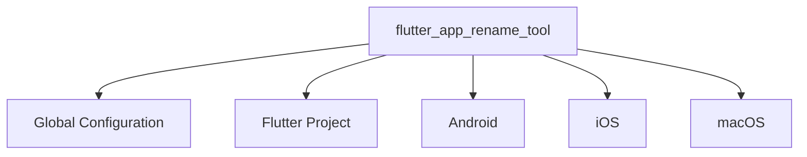

# Flutter App Rename Tool (English Version)

**Configuration File Structure**

### Configuration Hierarchy


### Full Feature Configuration Template
```yaml
# ===== Basic Identifier =====
flutter_app_rename_tool:
  app_name: far_altman  # Tool instance ID (for logging purposes)

  # ===== Cross-Platform Configuration =====
  flutter:
    enable: false # Optional
    app_name: far_altman_flutter  # Optional, ⚠️ Modifies the name field in pubspec.yaml

  # ===== Platform-Specific Configuration =====
  android:
    enable: true # Optional
    app_name: "Far Altman"      # Display name on desktop icons
    package: com.example.app.android  # Recommended to use reverse domain name format

  ios:
    enable: true # Optional
    app_name: "Far Altman"
    bundle_name: FARIOS
    bundle_id:
      debug: com.example.app.debug.ios
      release: com.example.app.prod.ios

  macos:
    enable: false # Optional
    app_name: "Far Altman"
    bundle_name: FARMac
    copyright: Copyright © ${year} FAR Inc.  # Supports ${year} variable
    bundle_id: com.example.app.macos
```

### Minimal Configuration Template
```yaml
flutter_app_rename_tool:
  android:
    package: com.example.app.ios  # Only set essential parameters
  
  ios:
    bundle_id: com.example.app.ios

  macos:
    bundle_id: com.example.app.macos
    copyright: Copyright © 2025 MyCompany  # Required field for macOS
```

---

## Configuration Field Details

### 📌 General Rules
- **Optional Fields**: If not configured, the original project values are retained.
- **Variable Support**: `${year}` is automatically replaced with the current year.
- **Multi-Environment Support**: Supports `debug`/`profile`/`release` segmentation.

### Quick Reference Table

| Platform | Key Field           | Example Value                | Requirement | Impact Scope            |
|----------|---------------------|------------------------------|-------------|-------------------------|
| All      | flutter.app_name    | my_app_flutter               | Optional   | Flutter project identifier |
| Android  | package             | com.company.app.android      | Recommended | Critical for app store listing |
| iOS      | bundle_id           | com.company.app.ios          | Recommended | Required for TestFlight distribution |
| macOS    | copyright           | Copyright © 2025 Company   | Recommended | Required for app signature validation |

---

## ⚠️ Key Considerations

### 1. Naming Conventions
```diff
+ Correct: com.company.app (Android)
+ Correct: com.company.app (iOS)
- Incorrect: My_App (Contains illegal character _)
```
