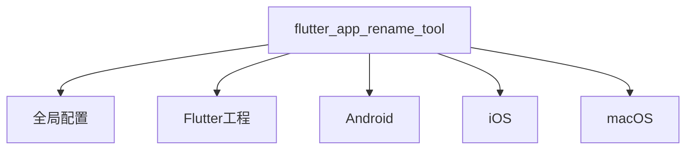

# Flutter App Rename Tool

## 配置文件结构（YAML格式）

**配置层级说明**


### 全功能配置模板
```yaml
# ===== 基础标识 =====
flutter_app_rename_tool:
  app_name: far_altman  # 工具实例ID（用于日志标识）

  # ===== 跨平台配置 =====
  flutter:
    app_name: far_altman_flutter  # ⚠️ 修改pubspec.yaml中的name字段

  # ===== 平台专属配置 =====
  android:
    app_name: "Far Altman"      # 桌面图标显示名称
    package: com.example.app.android  # 建议使用反向域名

  ios:
    app_name: "Far Altman"
    bundle_name: FARIOS
    bundle_id:
      debug: com.example.app.debug.ios
      release: com.example.app.prod.ios

  macos:
    app_name: "Far Altman"
    bundle_name: FARMac
    copyright: Copyright © ${year} FAR Inc.  # 支持${year}变量
    bundle_id: com.example.app.macos
```

### 极简配置模板
```yaml
flutter_app_rename_tool:
  android:
    package: com.example.app.ios  # 仅设置必要参数
  
  ios:
    bundle_id: com.example.app.ios

  macos:
    bundle_id: com.example.app.macos
    copyright: Copyright © 2025 MyCompany  # macOS必须字段
```

---

## 配置字段详解

### 📌 通用规则
- **可选字段**：不配置则保持项目原值
- **变量支持**：`${year}`自动替换为当前年份
- **多环境**：支持`debug`/`profile`/`release`分段配置

### 配置项速查表

| 平台    | 关键字段                | 示例值                     | 必要性 | 影响范围                |
|---------|-------------------------|---------------------------|--------|-------------------------|
| All     | flutter.app_name        | my_app_flutter           | 可选   | Flutter工程标识         |
| Android | package                 | com.company.app.android          | 推荐   | 应用商店上架关键ID       |
| iOS     | bundle_id               | com.company.app.ios          | 推荐   | TestFlight分发依赖      |
| macOS   | copyright               | Copyright © 2025 Company | 推荐   | 应用签名校验             |

---

## ⚠️ 关键注意事项

### 1. 命名规范
```diff
+ 正确示例: com.company.app (Android)
+ 正确示例: com.company.app (iOS)
- 错误示例: My_App (包含非法字符 _)
```

### 2. 多环境管理策略
```yaml
# 推荐方案：环境后缀法
ios:
  bundle_id:
    debug: com.company.app.debug
    release: com.company.app.prod
```

### 3. 版本控制建议
```bash
# 通过CI注入动态版本号
flutter_app_rename_tool:
  android:
    package: com.company.app.${BUILD_ENV}  # 由CI替换变量
```

---

## 最佳实践

### 跨平台命名一致性
```yaml
android:
  app_name: "应用名 app"

ios:
  app_name: "应用名 app"  # 保持各平台显示名称一致

macos:
  app_name: "应用名 app"
```

### 动态配置技巧
```yaml
macos:
  copyright: Copyright © ${year} ${COMPANY_NAME}  # 使用环境变量
```

### 调试建议
```bash
# 校验配置文件语法
flutter pub run flutter_app_rename_tool validate --config pubspec.yaml

# 预览修改效果（dry-run模式）
flutter_app_rename_tool apply --dry-run
```
