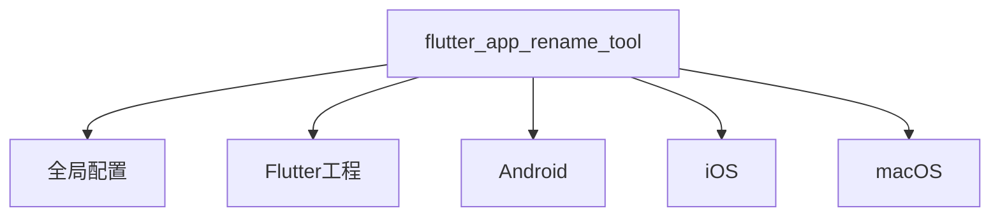

# Flutter App Rename Tool

## 配置文件结构（YAML格式）



### 配置示例
```yaml
# ===== 基础标识 =====
flutter_app_rename_tool:
  app_name: far_altman  # 工具实例ID（用于日志标识）

  # ===== Flutter 配置 =====
  flutter:
    enable: false # 可选，默认 true
    app_name: far_altman_flutter   # 可选，⚠️ 修改 pubspec.yaml 中的 name 字段

  # ===== 平台专属配置 =====
  android:
    enable: false
    app_name: Far Altman # 可选，桌面图标名称
    package: com.example.app.android

  ios:
    app_name: Far Altman
    bundle_name: FARIOS
    bundle_ids:
      debug: com.example.app.debug.ios
      profile: com.example.app.profile.ios
      release: com.example.app.release.ios

  macos:
    app_name: Far Altman
    bundle_name: FARMac
    copyright: Copyright © 2025 FAR Inc.
    bundle_id: com.example.app.macos
```

### 📌 iOS/macOS 多 Target 配置
```yaml
flutter_app_rename_tool:
  app_name: far_altman

  flutter:
    enable: false # 可选，默认 true
    app_name: far_altman_flutter

  android:
    app_name: Far Altman
    package: com.example.app.android

  ios:
    - app_name: Far Altman
      bundle_name: FARIOS
      target_name: Runner
      bundle_ids:
        debug: com.example.app.debug.ios
        profile: com.example.app.profile.ios
        release: com.example.app.release.ios

    - enable: false
      app_name: Far Altman Tests
      bundle_name: FARIOSTests
      target_name: RunnerTests
      bundle_ids:
        debug: com.example.RunnerTests.debug.ios
        profile: com.example.RunnerTests.profile.ios
        release: com.example.RunnerTests.release.ios

  macos:
    - enable: false
      app_name: Far Altman
      bundle_name: FARMac
      target_name: Runner
      copyright: Copyright © ${year} FAR Inc.
      bundle_id: com.example.app.macos

    - enable: false
      app_name: Far Altman Tests
      bundle_name: FARMacTests
      target_name: RunnerTests
      copyright: Copyright © ${year} FAR RunnerTests Inc.
      bundle_id: com.example.RunnerTests.macos
```

### 极简配置示例
```yaml
flutter_app_rename_tool:
  android:
    package: com.example.app.android  # 仅设置必要参数
  
  ios:
    bundle_id: com.example.app.ios

  macos:
    bundle_id: com.example.app.macos
    copyright: Copyright © 2025 MyCompany
```

---

## 配置字段详解

### 📌 通用规则
- **可选字段**：未配置时，保持项目原值。
- **多环境支持**：可针对 debug / profile / release 配置不同参数。
- **支持 iOS/macOS 多 Target**：允许针对不同 Target 进行独立配置。

### 配置项速查表

| 平台    | 关键字段         | 示例值                   | 必要性 | 影响范围         | 备注                                            |
| ------- | ---------------- | ------------------------ | ---------- | ---------------- | ----------------------------------------------- |
| All     | flutter.app_name | my_app_flutter           | 可选   | Flutter 工程标识   | 影响 `pubspec.yaml` 中的 `name`                 |
| Android | enable           | true                     | 可选   | 是否修改 Android   | 关闭后不修改 Android 相关配置                   |
| Android | app_name         | Far Altman               | 可选   | 桌面图标显示名称    | 影响 `AndroidManifest.xml`                      |
| Android | package          | com.company.app.android  | 建议   | 应用 id           | 影响 `AndroidManifest.xml` 和 Gradle 配置       |
| iOS     | enable           | true                     | 可选   | 是否修改 iOS       | 关闭后不修改 iOS 相关配置                       |
| iOS     | app_name         | Far Altman               | 可选   | 应用显示名称        | 影响 `Info.plist` 中 `CFBundleDisplayName`      |
| iOS     | bundle_name      | FARIOS                   | 可选   | 应用内部标识        | 影响 `Info.plist` 中 `CFBundleName`             |
| iOS     | bundle_id        | com.company.app.ios      | 建议   | 应用唯一标识        | 影响 `Info.plist` 中 `CFBundleIdentifier`       |
| macOS   | enable           | false                    | 可选   | 是否修改 macOS     | 关闭后不修改 macOS 相关配置                     |
| macOS   | app_name         | Far Altman               | 可选   | 应用显示名称     | 影响 `Info.plist` 中 `CFBundleDisplayName`      |
| macOS   | bundle_name      | FARMac                   | 可选   | 应用内部标识     | 影响 `Info.plist` 中 `CFBundleName`             |
| macOS   | bundle_id        | com.company.app.macos    | 建议   | 应用唯一标识     | 影响 `Info.plist` 中 `CFBundleIdentifier`       |
| macOS   | copyright        | Copyright © 2025 Company | 可选   | 应用签名校验     | 影响 `Info.plist` 中 `NSHumanReadableCopyright` |

---

## ⚠️ 关键注意事项

### 1. 命名规范
```diff
+ 正确: com.company.app (Android/iOS)
- 错误: My_App (包含非法字符 _)
```

### 2. 多种环境
```yaml
ios:
  bundle_id:
    debug: com.company.app.debug
    release: com.company.app.release
```

### 3. 多个Target
```bash
ios:
  - app_name: Far Altman
    bundle_name: FARIOS
    target_name: Runner
    bundle_id: com.example.app.ios
    
  - enable: false
    app_name: Far Altman Tests
    bundle_name: FARIOSTests
    target_name: RunnerTests
    bundle_id: com.example.RunnerTests.ios
```

---

## 最佳实践

### 跨平台命名一致性
```yaml
android:
  app_name: "应用名 app"

ios:
  app_name: "应用名 app"

macos:
  app_name: "应用名 app"
```

### 调试
```bash
# 校验配置文件语法
flutter pub run flutter_app_rename_tool validate --config pubspec.yaml

# 预览修改效果（dry-run 模式）
flutter_app_rename_tool apply --dry-run
```

